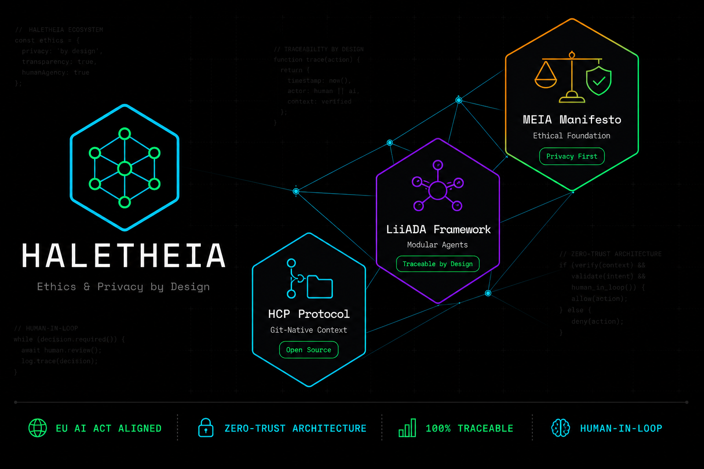
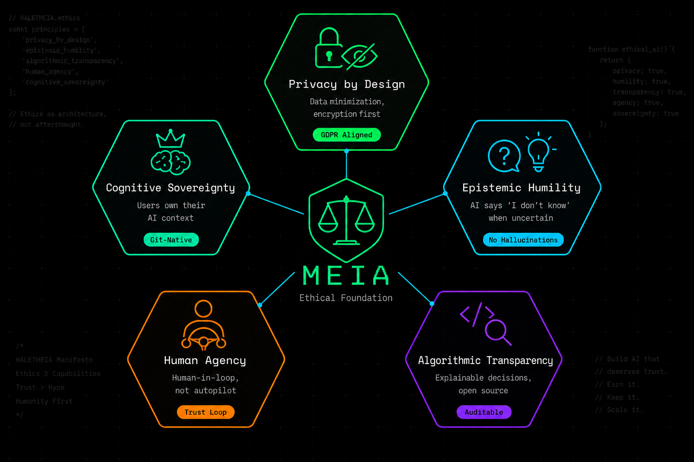
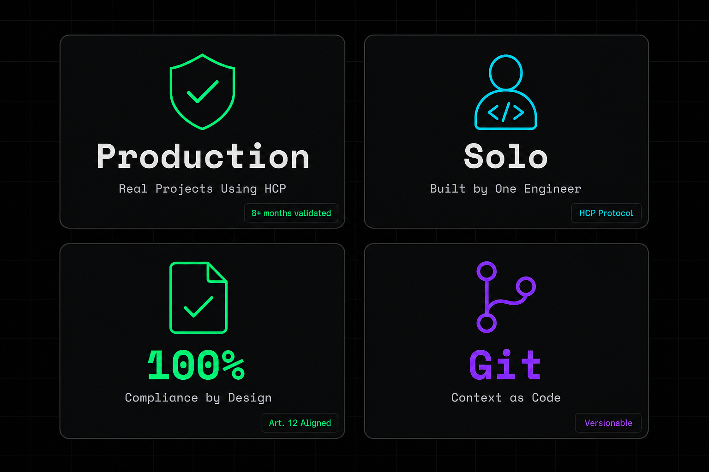

<div align="center">



[](https://www.gnu.org/licenses/agpl-3.0)
[]()
[]()
[]()

**[🇬🇧 English Version](./README.md)**

</div>

---

## 🎯 La Crisis Estructural que HALETHEIA Resuelve

La Inteligencia Artificial empresarial enfrenta una **crisis de confianza estructural**:

- 🔴 **Alucinaciones no detectadas** → Decisiones empresariales incorrectas
- 🔴 **Falta de trazabilidad** → Imposible auditar para EU AI Act
- 🔴 **Cajas negras monolíticas** → No puedes depurar ni optimizar
- 🔴 **Contexto efímero** → Los agentes pierden memoria entre sesiones

**El problema real:** Los frameworks de IA nacieron para prototipos, no para producción regulada. Las empresas intentan parchear *compliance* a última hora, y fracasan.

### 💡 La Solución HALETHEIA

Invertimos el paradigma: **La gobernanza y la ética no son un filtro externo, son la arquitectura base.**

Construimos el ecosistema estructural que:
- ✅ **Optimiza a las personas**, no a los procesos
- ✅ **Audita a los agentes**, no confía ciegamente
- ✅ **Preserva la agencia humana**, no automatiza todo

---

## 🧬 El Ecosistema HALETHEIA

Nuestro stack se divide en **Open Source (Legos)** y **Enterprise (Castle)**:

### 🟢 Open Source: Primitivas para IA Responsable

Liberamos nuestros protocolos y frameworks fundamentales para que la comunidad construya agentes éticos y trazables.

<table>
<tr>
<td width="33%" align="center">

### 📚 HCP Protocol
**Gestión de Contexto Git-Native**

Si el código merece Git, el contexto merece estructura.

HCP es el **primer protocolo git-native** para gobernar el contexto entre humanos y LLMs mediante directorios estructurados (`.procontext/`).

**Impacto real:**
- ✅ Validado en producción (8+ meses)
- ✅ Construido por un solo ingeniero
- ✅ Probado en proyectos reales
- ✅ Convergencia con SPDD (Martin Fowler)

[](https://github.com/haletheia/hcp)

</td>
<td width="33%" align="center">

### 🧠 LiiADA Framework
**Orquestación Modular de Agentes**

Framework de orquestación 100% modular.

A diferencia de las cajas negras monolíticas, LiiADA conecta **memoria (CIPP)**, **RAGs multidominio** y **proveedores LLM** con trazabilidad desde el primer token.

**Arquitectura hexagonal:**
- ✅ 13 módulos independientes
- ✅ Capacidades Plug & Play
- ✅ Observabilidad integrada
- ✅ Multi-LLM (Ollama, OpenAI, Anthropic, Gemini)

[](https://github.com/haletheia/liiada-core)

</td>
<td width="33%" align="center">

### 📜 MEIA Manifiesto
**Fundamento Ético**

El corazón filosófico que guía nuestro código.

La **"Ética del Excluido"** materializada en principios de desarrollo de software: Privacy by Design, Humildad Epistémica y Transparencia Algorítmica.

**52+ documentos interactivos:**
- ✅ 11 capítulos principales
- ✅ 40+ casos éticos analizados
- ✅ Sistema dinámico vivo (Astro)
- ✅ Métricas en tiempo real

[](https://github.com/haletheia/meia)

</td>
</tr>
</table>

---

## 🏛️ Los 5 Pilares Éticos de MEIA

<div align="center">



</div>

### 🔒 1. Privacy by Design
**No es compliance, es arquitectura.**

- Minimización de datos desde el diseño inicial
- Cifrado por defecto, no como parche
- GDPR y CCPA aligned desde la primera línea de código

### 🤔 2. Humildad Epistémica
**La IA admite cuando no sabe.**

- No hay alucinaciones "creativas" en producción
- Métricas de confianza en cada respuesta
- El agente dice "no tengo suficiente información" cuando es necesario

### 🔍 3. Transparencia Algorítmica
**Decisiones explicables, código auditable.**

- Open Source por defecto (Legos)
- Logs estructurados y versionados (Git-Native)
- Trazabilidad de cada token generado

### 🧭 4. Agencia Humana
**Humanos en el loop, no en autopilot.**

- Trust Loop: El usuario aprueba cada evidencia
- Control granular sobre autonomía del agente
- Siempre puedes detener, revisar o modificar

### 👑 5. Soberanía Cognitiva
**Los usuarios poseen su contexto de IA.**

- Contexto versionado en Git (no lock-in)
- Exportable, auditable, transferible
- No dependes de un proveedor para tu conocimiento

> *"Optimizar personas, no procesos. Desocultar la verdad, mantener el control."*  
> — Principio fundacional de MEIA

---

## 📊 Validación Real

<div align="center">



</div>

### 🌍 Validación Externa

**Convergencia con la industria:**
- ✅ **Martin Fowler (ThoughtWorks)**: SPDD (Structured Prompt-Driven Development) valida el enfoque HCP
- ✅ **Anthropic**: Los patrones Claude.md convergen con HCP
- ✅ **GitHub**: Copilot Workspace adopta contexto estructurado

**Honestidad sobre el camino:**
- 🏗️ Construido en solitario por un solo ingeniero durante 8+ meses
- ✅ Validado en proyectos reales de producción (proyectos propios)
- ✅ Protocolos Open Source con fundamento filosófico claro
- ✅ Sin números de estrellas falsos, sin métricas infladas
- 🎯 Enfoque: Calidad y coherencia sobre métricas de vanidad

---

## 🔵 Enterprise: Compliance y Producción Regulada

El ecosistema Open Source de HALETHEIA encarna la transparencia. Sin embargo, para despliegues en entornos **altamente regulados** (finanzas, salud, gobierno), las organizaciones requieren:

- 🔐 **Auditorías criptográficas inmutables**
- 🏗️ **Aislamiento de hardware (KVM)**
- 🎛️ **Control de accesos granular (RBAC)**
- 📋 **Reportes EU AI Act automáticos**

Para estos casos, ofrecemos nuestra capa **Enterprise (Castle)**:

### 🏢 NIDALI Enterprise Harness

<table>
<tr>
<td width="50%">

#### 🎨 NIDALI UI
**Dashboard corporativo y Trust Loop humano.**

- Panel de control unificado para todos tus agentes
- Validación humana de cada evidencia (Trust Loop)
- Gestión de bóvedas curadas de conocimiento
- Métricas de confianza en tiempo real

</td>
<td width="50%">

#### 🛡️ Sentinel Gateway
**Firewall reactivo y prevención de alucinaciones.**

- API Gateway 100% no-bloqueante (Java 21 reactive)
- Circuit Breakers para LLMs (Resilience4j)
- Enrutamiento inteligente (LiiADA ↔ Hidden Brain)
- Timeouts asimétricos por proveedor

</td>
</tr>
<tr>
<td width="50%">

#### 🧠 Hidden Brain (RAG 4.0)
**Knowledge Base generativa y auditable.**

- Agentic RAG con Pydantic AI
- Knowledge Integrity (Karpathy Linter)
- Token Optimization (aronly: -60-90%)
- Audit & Traceability (cutufato logs)
- Knowledge Graph (Neo4j) + Vector Search (pgvector)

</td>
<td width="50%">

#### 🏝️ Marisma Sandbox
**Aislamiento hardware para ejecución de código.**

- Unikernels efímeros (KVM, no Docker)
- VMs de megabytes (no gigabytes)
- Seguridad radical: aislamiento por hardware
- ROI: 40-60% ahorro cloud vs contenedores

</td>
</tr>
</table>

### 📋 Cumplimiento EU AI Act

HALETHEIA Enterprise genera automáticamente **evidencias de auditoría** según el Artículo 12 del EU AI Act:

- ✅ **Logs estructurados** de cada decisión del agente
- ✅ **Trazabilidad completa** desde input hasta output
- ✅ **Métricas de confianza** por cada respuesta
- ✅ **Reportes exportables** para auditorías

🏢 **[Descubre nuestras soluciones Enterprise](https://haletheia.github.io)**

---

## 🛠️ Herramientas y Gemas OSS

Además de nuestro core, HALETHEIA publica herramientas de seguridad y optimización bajo licencia MIT/AGPL:

| Herramienta | Propósito | Impacto |
|-------------|-----------|---------|
| **[aronly](https://github.com/drhiidden/aronly)** | Optimización de tokens (Rust) | ↓ 60-90% uso de tokens |
| **[babuino](https://github.com/drhiidden/babuino)** | Aislamiento hardware (KVM) | Ejecución segura de código IA |
| **[xokito](https://github.com/drhiidden/xokito)** | Framework de privacidad | Ofuscación y redacción de PII |
| **[cutufato](https://github.com/drhiidden/cutufato)** | Logs auditables | Trazabilidad criptográfica |

---

## 🚀 Empieza Ahora

### 👨‍💻 Para Desarrolladores

**Quickstart con HCP:**
```bash
# 1. Instala HCP Toolkit
git clone https://github.com/haletheia/hcp.git
cd hcp && npm install -g

# 2. Inicializa un proyecto
hcp init --template=minimal

# 3. Usa contexto estructurado
hcp verify  # Valida tu .procontext/
```

**Quickstart con LiiADA:**
```bash
# 1. Instala LiiADA Core
pip install liiada-core

# 2. Configura tu primer agente
from liiada import Agent, LLM

agent = Agent(
    llm=LLM.ollama(model="llama3"),
    memory="episodic",
    traceable=True
)

# 3. Genera con trazabilidad
response = agent.generate("¿Cómo optimizar este código?")
print(response.audit_log)  # Ver trazabilidad completa
```

**Recursos:**
- 📚 [Documentación completa](https://haletheia.github.io/docs)
- 💬 [Comunidad Discord](https://discord.gg/haletheia)
- 📺 [Tutoriales YouTube](https://youtube.com/@haletheia)

### 🏢 Para CISOs y CTOs

¿Necesitas cumplir con EU AI Act? ¿Buscas IA empresarial sin cajas negras?

- 📅 **[Agenda una demo](https://haletheia.github.io/demo)**
- 📋 **[Únete a la Waitlist Enterprise](https://haletheia.github.io/waitlist)**
- 📧 **[Contacto directo](mailto:enterprise@haletheia.ai)**

---

## 🌐 Recursos Adicionales

### 📖 Documentación Técnica
- [HCP Whitepaper](https://github.com/haletheia/hcp/blob/main/WHITEPAPER.md)
- [LiiADA Architecture Docs](https://github.com/haletheia/liiada-core/tree/main/docs)
- [MEIA Platform (52+ documentos)](https://github.com/haletheia/meia)

### 🎓 Aprendizaje
- [Blog Técnico (drhidden.github.io)](https://drhidden.github.io)
- [Casos de Estudio](https://haletheia.github.io/case-studies)
- [Webinars y Talleres](https://haletheia.github.io/events)

### 🤝 Comunidad
- [Contribuir a HALETHEIA](https://github.com/haletheia/.github/blob/main/CONTRIBUTING.md)
- [Código de Conducta](https://github.com/haletheia/.github/blob/main/CODE_OF_CONDUCT.md)
- [Roadmap 2026-2027](https://haletheia.github.io/roadmap)

---

## 📜 Licencias y Filosofía

- **Open Source (Legos):** AGPL-3.0 / MIT según proyecto
- **Enterprise (Castle):** Licencia comercial con soporte

**Filosofía:**
> *"La tecnología debe servir a las personas, no reemplazarlas. Los agentes de IA deben amplificar la inteligencia humana, no oscurecerla. La ética no es un checkbox de compliance, es la arquitectura base."*

---

<div align="center">

### 🌟 Únete al Movimiento

**Estamos construyendo el futuro de la IA responsable. Únete a nosotros.**

[](https://github.com/haletheia)
[](https://twitter.com/haletheia)
[](https://linkedin.com/company/haletheia)

---

**HALETHEIA AI Lab**  
*Desocultar la verdad. Mantener el control.*

🌐 [haletheia.github.io](https://haletheia.github.io) | 📧 [hello@haletheia.ai](mailto:hello@haletheia.ai)

</div>
